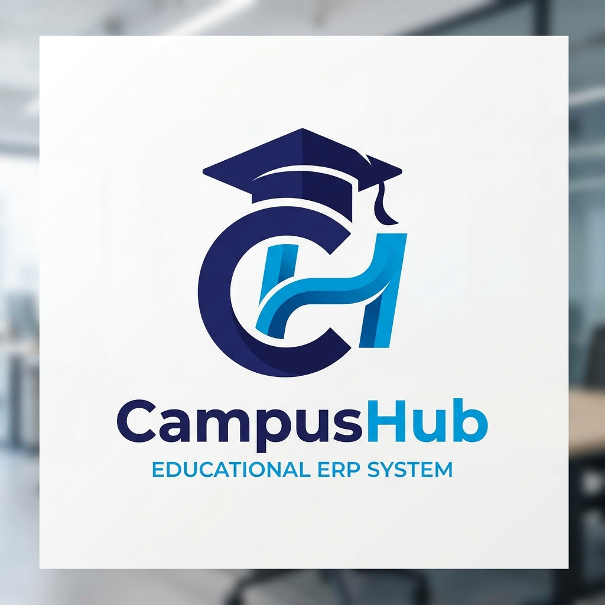
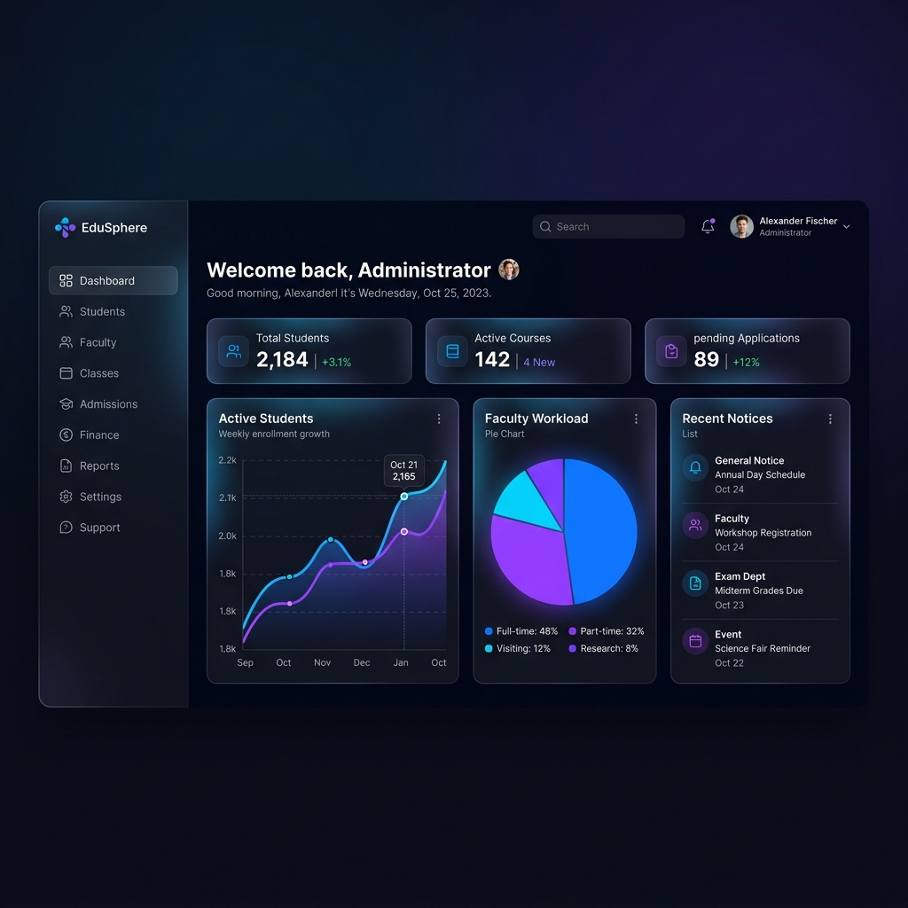

# 🎓 CampusHub ERP

[](https://github.com/rishipatel017/ADIT-StudentPortal)
[](https://opensource.org/licenses/MIT)
[]()

**CampusHub** is a premium, full-stack Academic & Administrative Management System designed to streamline educational workflows. Built with a focus on performance, scalability, and high-end aesthetics, it provides a centralized platform for Students, Faculty, and Administrators.



---

## 🚀 Core Features

### 🏛️ Administrator Portal
*   **Centralized Control**: Manage the entire academic structure including Departments, Semesters, and Divisions.
*   **User Management**: Seamless onboarding and management of Student and Faculty profiles.
*   **Data Analytics**: Real-time dashboard statistics for institutional oversight.
*   **Academic Logistics**: Link faculty to specific subjects and divisions with precision.

### 👨‍🏫 Faculty Workspace
*   **Attendance Tracking**: Effortless digital attendance management for every lecture.
*   **Marks Upload Engine**: High-speed marks entry with CSV template support for bulk uploads.
*   **Assignment Hub**: Create, distribute, and evaluate student assignments digitally.
*   **Communication**: Broadcast notices to specific divisions or the entire department.

### 🎓 Student Experience
*   **Personal Dashboard**: View upcoming deadlines, latest marks, and attendance stats.
*   **Submission Portal**: Securely submit assignments and track evaluation status.
*   **Real-time Alerts**: Instant notifications for new notices, marks, and academic updates.
*   **Integrated Chat**: Direct communication channels for academic collaboration.

---

## 💻 Technology Stack

### Backend Infrastructure
*   **NestJS**: Progressive Node.js framework for efficient, reliable and scalable server-side applications.
*   **Prisma ORM**: Next-generation Node.js and TypeScript ORM for robust database management.
*   **MySQL**: Relational database for structured academic data.
*   **JWT & Bcrypt**: Secure authentication and industry-standard password hashing.

### Frontend Experience
*   **Next.js 14**: The React framework for production-grade web applications.
*   **Tailwind CSS**: Utility-first CSS framework for bespoke, premium designs.
*   **Lucide Icons**: Beautifully crafted open-source icons for modern UIs.
*   **Axios**: Promise-based HTTP client for seamless API integration.



---

## 🛠️ Getting Started

### Prerequisites
*   [Node.js](https://nodejs.org/) (v18.0 or higher)
*   [MySQL](https://www.mysql.com/) (v8.0 or higher)
*   [Docker](https://www.docker.com/) (Optional, for containerized deployment)

### Installation

1. **Clone the Repository**
   ```bash
   git clone https://github.com/rishipatel017/ADIT-StudentPortal.git
   cd ADIT-StudentPortal
   ```

2. **Backend Setup**
   ```bash
   cd backend
   npm install
   cp .env.example .env
   # Update .env with your database credentials
   npx prisma migrate dev
   npx prisma db seed
   npm run start:dev
   ```

3. **Frontend Setup**
   ```bash
   cd ../frontend
   npm install
   cp .env.example .env.local
   npm run dev
   ```

---

## 📦 Deployment with Docker

CampusHub is fully containerized for easy deployment.

```bash
docker-compose up --build
```

For optimized production environments, use the optimized configuration:
```bash
docker-compose -f docker-compose.optimized.yml up -d
```

---

## 📜 License

Distributed under the MIT License. See `LICENSE` for more information.

---

<p align="center">
  Developed with ❤️ for Academic Excellence.
</p>
